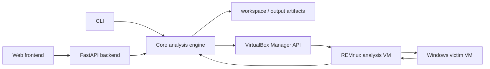

# AIM - AI Malware Analysis

AIM is a modular malware analysis platform that combines traditional static, dynamic, and reverse engineering workflows with AI-assisted inference, enrichment, and report generation. It also incorporates an agentic reverse engineering component that autonomously assists analysts by exploring binaries, reasoning about program behavior, and orchestrating reverse engineering tasks.

It is designed to help analysts process Windows malware samples in a repeatable way. Deterministic analysis tools collect evidence, AI components reason over selected outputs, and the reverse engineering agent autonomously explores and analyzes the binary. All analysis results are stored under a SHA-256-based analysis directory.

## What AIM Solves

Malware analysis often requires switching between static tools, dynamic lab
execution, reverse engineering, manual notes, and report writing. AIM provides a
single pipeline that keeps those steps connected while preserving raw and parsed
artifacts for later review.

## Main Features

| Area | Capabilities |
| --- | --- |
| Static analysis | File type, hashes, metadata, packer indicators, strings, PE data, and VirusTotal |
| Dynamic analysis | Windows victim execution, REMnux receiver, Autoruns, Registry exports, and Procmon artifacts |
| AI inference | Static string inference and dynamic behavior inference |
| Reverse engineering | Manual radare2 tools and an AI reversing agent |
| Reporting | Incremental enrichment and technical report generation |
| Web interface | Upload, search, reanalyze, and inspect analysis artifacts |

## Architecture Overview



The project is split into clear layers:

- `core/`: analysis logic, tool runners, AI runners, preprocessing, and postprocessing.
- `cli/`: command-line argument parsing.
- `backend/`: FastAPI adapter for web execution and artifact access.
- `frontend/`: React + TypeScript interface.
- `setup/`: start/stop scripts and VirtualBox host API and VM management helpers.
- `docs/`: project documentation.

## Quick Installation

Clone github repository:

```bash
git clone https://github.com/pablo-972/AIM
```

Go to the project root directory:

```bash
cd AIM/
```

Copy the environment template:

```bash
cp .env.example .env
```

Start the platform:

**Linux/macOS**

```bash
./setup/start.sh
```

**Windows (PowerShell)**

```powershell
.\setup\start.ps1
```

To also start the backend and frontend Docker profiles:

**Linux/macOS**

```bash
./setup/start.sh --backend
```

**Windows (PowerShell)**

```powershell
.\setup\start.ps1 -Backend
```

The web UI is exposed at `http://localhost:5173`.

## Documentation

- [Getting Started](docs/getting-started/README.md)
- [Architecture](docs/architecture/README.md)
- [Phases](docs/phases/README.md)
- [Tools](docs/tools/README.md)
- [AI](docs/ai/README.md)
- [Troubleshooting](docs/troubleshooting/README.md)

## License

See [LICENSE](LICENSE).
