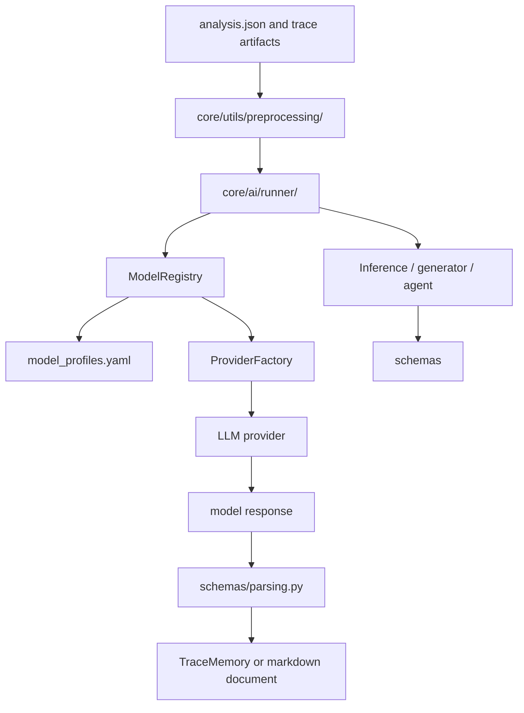

# AI

AIM's AI layer reads evidence produced by deterministic phases and turns it into
structured findings, enrichment notes, reverse engineering decisions, and final
report text.

The AI layer is intentionally separated from tools:

- tools collect and parse evidence;
- preprocessing selects model inputs;
- AI runners control workflow state;
- inference or agent classes build prompts and parse decisions;
- providers handle model API differences.

## Flow



## Directory Layout

```text
core/ai/
    agents/
    inferences/
    providers/
    runner/
    runtime/
    schemas/
    model_profiles.yaml
    model_registry.py
```

| Directory | Purpose |
| --- | --- |
| `agents/` | Agent prompt logic, currently the reversing agent |
| `inferences/` | Task-specific prompt logic for static, dynamic, enrichment, and report |
| `providers/` | Ollama and OpenAI-compatible HTTP clients |
| `runner/` | Workflow orchestration for each AI task |
| `runtime/` | Shared execution state, trace memory, agent validation, and reversing loop helpers |
| `schemas/` | JSON schemas and response parsing helpers |

## Model Profiles

AI model selection is configured in:

```text
core/ai/model_profiles.yaml
```

The file has four main sections:

| Section | Purpose |
| --- | --- |
| `providers` | Defines provider type, base URL, and optional API key source |
| `profiles` | Defines model, temperature, response format, and provider |
| `tasks` | Selects the default profile for task runners |
| `agents` | Selects the default profile for agent runners |

The registry resolves model clients through this chain:

```text
task or agent name -> default profile -> provider -> provider client
```

Profiles can read values from environment variables:

```yaml
model:
  env: GEMINI_DYNAMIC_MODEL
  default: "gemini-2.5-flash"
```

This allows the same code to run against local Ollama, OpenAI-compatible APIs,
or Gemini-compatible OpenAI endpoints.

## Registry and Factory

`ModelRegistry` lives in:

```text
core/ai/model_registry.py
```

It is responsible for:

- reading task and agent defaults;
- resolving profile overrides;
- validating profile/provider entries;
- creating provider clients through `ProviderFactory`.

`ProviderFactory` lives in:

```text
core/ai/providers/factory.py
```

It converts a profile and provider config into a concrete provider:

| Provider type | Client |
| --- | --- |
| `ollama` | `OllamaProvider` |
| `openai` | `OpenAICompatibleProvider` |
| `gemini` | `OpenAICompatibleProvider` |

The rest of the AI layer receives only the shared provider interface, so runners
and inference classes do not need provider-specific branches.

## Providers

Providers live in:

```text
core/ai/providers/
```

The shared interface is defined in `base.py`:

- `chat`
- `chat_json`
- `chat_with_assistant`
- `chat_json_with_assistant`

`OllamaProvider` sends requests to:

```text
/api/chat
```

When a JSON schema is supplied, Ollama receives it in the `format` field. This
is why schemas matter for local SLM execution: they give Ollama a concrete JSON
shape to produce.

`OpenAICompatibleProvider` sends requests to:

```text
/chat/completions
```

When a JSON schema is supplied, it is sent through `response_format`. The same
provider path is used for OpenAI-compatible cloud APIs and Gemini's
OpenAI-compatible endpoint.

## Schemas

Schemas live in:

```text
core/ai/schemas/
```

They serve two purposes:

1. Give JSON-capable providers, especially Ollama, an explicit response shape.
2. Validate or normalize model responses before runners persist them.

Important files:

| File | Purpose |
| --- | --- |
| `static.py` | Static strings inference JSON schema |
| `dynamic.py` | Dynamic behavior inference JSON schema |
| `reversing.py` | Reversing seed, action, target, and finding schemas |
| `parsing.py` | Defensive parsing and fallback responses |

The parser layer is deliberately defensive. If a model returns empty text,
invalid JSON, missing keys, or wrong confidence values, AIM records a low
confidence fallback instead of crashing the whole run.

## Runtime

Runtime helpers live in:

```text
core/ai/runtime/
```

They are shared by AI runners and agents.

| File | Purpose |
| --- | --- |
| `memory.py` | Stores trace steps, findings, queue events, errors, and compact tool outputs |
| `executor.py` | Executes validated agent tool calls |
| `validators.py` | Normalizes and validates model-requested tool parameters |
| `reversing/` | Queue, initialization, exploration loop, evidence evaluation, and target logic |

`TraceMemory` is used by inference and agent runners that need a structured JSON
trace. It stores:

- steps;
- findings;
- artifacts;
- queue events;
- errors;
- final status.

The reversing runtime adds the bounded agent loop:

1. initialize targets from enrichment or reconnaissance;
2. push targets into a priority queue;
3. execute the highest-priority unvisited target;
4. split large evidence into chunks;
5. evaluate each chunk;
6. record findings;
7. enqueue follow-up targets when useful.

## Inference Models

Inference classes live in:

```text
core/ai/inferences/
```

They are responsible for prompt construction and response parsing. They do not
own persistence or pipeline state.

| Class | Purpose |
| --- | --- |
| `StaticInference` | Looks for natural-language threat messages in strings |
| `DynamicInference` | Looks for behavioral findings in dynamic evidence sections |
| `EnrichmentGenerator` | Updates the enrichment document from prior outputs |
| `ReportGenerator` | Updates the final report from all available evidence |

The matching runners live in `core/ai/runner/` and own the workflow around each
inference class.

## Agents

Agents live in:

```text
core/ai/agents/
```

The current agent is:

```text
core/ai/agents/reversing.py
```

The reversing agent differs from simple inference:

- it can request tool actions;
- it works with an explicit queue;
- it reads tool contracts;
- it records queue events and tool decisions;
- it must ground findings in executable-code evidence.

The model-callable reversing tools are defined outside the AI layer:

```text
core/tools/reversing/agent.py
core/tools/reversing/agent_tools.json
```

The AI runtime validates model actions against that JSON contract before any
tool is executed.

## Adding an AI Task

To add a new model-backed task:

1. Add schemas under `core/ai/schemas/` if the task expects JSON.
2. Add prompt and parsing logic under `core/ai/inferences/`.
3. Add a runner under `core/ai/runner/`.
4. Add preprocessing helpers under `core/utils/preprocessing/` if the raw
   artifacts need selection, chunking, or compaction.
5. Register a default task profile in `core/ai/model_profiles.yaml`.
6. Call the runner from the orchestrator or from an existing phase.

## Adding an Agent

To add an agent:

1. Add agent prompt logic under `core/ai/agents/`.
2. Add tool contracts under the relevant `core/tools/<phase>/` directory.
3. Add or reuse runtime helpers for queueing, memory, and validation.
4. Add a runner under `core/ai/runner/`.
5. Register the default agent profile in `core/ai/model_profiles.yaml`.
6. Ensure findings are postprocessed and grounded before being persisted.

## Adding a Provider

To add a provider:

1. Implement the shared provider interface in `core/ai/providers/`.
2. Register the provider type in `ProviderFactory`.
3. Add provider configuration to `core/ai/model_profiles.yaml`.
4. Add one or more profiles using that provider.

Keep provider differences inside `core/ai/providers/`. Runners and inference
classes should continue using only the shared interface.
