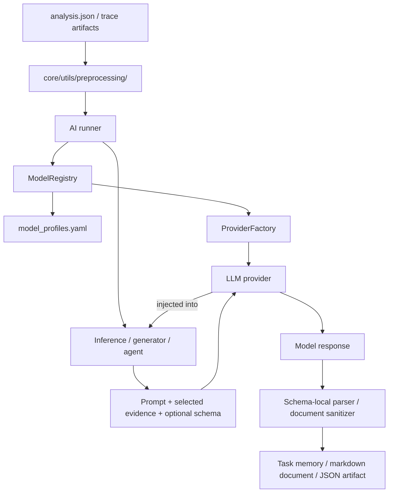

# AI

AIM's AI layer reads evidence produced by deterministic phases and turns it into
structured findings, enrichment notes, reverse-engineering decisions, and final
report text.

The AI layer is intentionally separated from tools:

- tools collect and parse evidence;
- preprocessing selects model inputs;
- AI runners control workflow state;
- inference, generator, or agent classes build prompts and parse decisions;
- providers handle model API differences.

## Flow


```mermaid
flowchart TD
    Artifacts[analysis.json / trace artifacts] --> Preprocessing[core/utils/preprocessing/]
    Preprocessing --> Runner[AI runner]

    Runner --> Registry[ModelRegistry]
    Registry --> Profiles[model_profiles.yaml]
    Registry --> Factory[ProviderFactory]
    Factory --> Provider[LLM provider]

    Runner --> ModelLogic[Inference / generator / agent]
    Provider -- injected into --> ModelLogic

    ModelLogic --> Request[Prompt + selected evidence + optional schema]
    Request --> Provider

    Provider --> Response[Model response]
    Response --> Parsing[Schema-local parser / document sanitizer]
    Parsing --> Output[Task memory / markdown document / JSON artifact]
```

## Directory Layout

```text
core/ai/
    agents/
    inferences/
    providers/
    runner/
    runtime/
    schemas/
    model_profiles.yaml
    model_registry.py
```

| Directory | Purpose |
| --- | --- |
| `agents/` | Agent prompt logic, currently the reversing agent |
| `inferences/` | Task-specific prompt logic for static, dynamic, enrichment, and report |
| `providers/` | Ollama, OpenAI-compatible, and Gemini HTTP clients |
| `runner/` | Workflow orchestration for each AI task |
| `runtime/` | Tool execution helpers, inference memories, and reversing agent runtime |
| `schemas/` | JSON schemas and response parsing helpers |

## Model Profiles

AI model selection is configured in:

```text
core/ai/model_profiles.yaml
```

The file has four main sections:

| Section | Purpose |
| --- | --- |
| `providers` | Defines provider type, base URL, and optional API key source |
| `profiles` | Defines model, temperature, response format, and provider |
| `tasks` | Selects the default profile for task runners |
| `agents` | Selects the default profile for agent runners |

The registry resolves model clients through this chain:

```text
task or agent name -> default profile -> provider -> provider client
```

Profiles can read values from environment variables:

```yaml
model:
  env: GEMINI_DYNAMIC_MODEL
  default: "gemini-3.5-flash"
```

This allows the same code to run against local Ollama, OpenAI-compatible APIs,
or the native Gemini API.

## Registry And Factory

`ModelRegistry` lives in:

```text
core/ai/model_registry.py
```

It is responsible for:

- reading task and agent defaults;
- resolving profile overrides;
- validating profile/provider entries;
- creating provider clients through `ProviderFactory`.

`ProviderFactory` lives in:

```text
core/ai/providers/factory.py
```

It converts a profile and provider config into a concrete provider:

| Provider type | Client |
| --- | --- |
| `ollama` | `OllamaProvider` |
| `openai` | `OpenAICompatibleProvider` |
| `gemini` | `GeminiProvider` |

The rest of the AI layer receives only the shared provider interface, so runners
and model logic do not need provider-specific branches.

Runners may still adapt how evidence is batched before it reaches the model.
Local SLM profiles favor smaller chunks. Cloud profiles such as `openai` and
`gemini` favor fewer calls, so enrichment and report sources are grouped by
phase before being sent to the model.

## Providers

Providers live in:

```text
core/ai/providers/
```

The shared interface is defined in `base.py`:

- `chat`
- `chat_json`
- `chat_with_assistant`
- `chat_json_with_assistant`
- `chat_tools`

`OllamaProvider` sends requests to `/api/chat`. When a JSON schema is supplied,
Ollama receives it in the `format` field. Ollama also exposes native tool calls
and thinking when the selected model/provider response includes them.

`OpenAICompatibleProvider` sends requests to `/chat/completions`. When a JSON
schema is supplied, it is sent through `response_format` using strict
`json_schema` formatting.

`GeminiProvider` sends requests to the native Gemini Interactions API. Gemini
receives the system prompt through `system_instruction`, the user-facing prompt
through `input`, and JSON schemas through its native `response_format` shape.

## Schemas

Schemas live in:

```text
core/ai/schemas/
```

They serve two purposes:

1. Give JSON-capable providers, especially Ollama, an explicit response shape.
2. Validate or normalize model responses before runners persist them.

Important files:

| File | Purpose |
| --- | --- |
| `static.py` | Static inference schema, parser, and fallback response |
| `dynamic.py` | Dynamic behavior inference schema, parser, and fallback response |
| `reversing.py` | Reversing finding schema and fallback response helpers |
| `report.py` | Structured report schema and final assessment validation |

Each schema file owns the parser for the response it describes. This keeps the
contract, validation, and fallback behavior together.

## Runtime

Runtime helpers live in:

```text
core/ai/runtime/
```

| File | Purpose |
| --- | --- |
| `executor.py` | Executes validated agent tool calls |
| `tool_validator.py` | Validates model-requested tool parameters against tool schemas |
| `inference/` | Static and dynamic inference memory writers |
| `reversing/` | Reversing agent analysis, memory, queue, initialization, exploration, target validation, and trace formatting |

Inference memories are intentionally small and task-specific. They store compact
`steps`, global `findings`, `findings_count`, and `errors`. The reversing agent
uses its own runtime because it owns a queue, tool validation, trace formatting,
and global review.

## Inference Models

Inference and generator behavior is documented by phase:

| Phase | Model logic | Runner | Output |
| --- | --- | --- | --- |
| [Static](static.md) | `StaticInference` | `StaticInferenceRunner` | `static_inference.json` |
| [Dynamic](dynamic.md) | `DynamicInference` | `DynamicInferenceRunner` | `dynamic_inference.json` |
| [Enrichment](enrichment.md) | `EnrichmentGenerator` | `EnrichmentAIRunner` | `enrichment.md` |
| [Report](report.md) | `ReportGenerator` | `ReportAIRunner` | `report.md`, `assessment.json` |

## Agents

| Agent | Model logic | Runner | Output |
| --- | --- | --- | --- |
| [Reversing Agent](reversing-agent.md) | `ReversingAgent` | `ReversingAgentRunner` | `reversing_agent.json` |

## Adding An AI Task

To add a new model-backed task:

1. Add schemas and response parsers under `core/ai/schemas/` if the task expects JSON.
2. Add prompt and task logic under `core/ai/inferences/`.
3. Add a runner under `core/ai/runner/`.
4. Add preprocessing helpers under `core/utils/preprocessing/` if the raw
   artifacts need selection, chunking, or compaction.
5. Register a default task profile in `core/ai/model_profiles.yaml`.
6. Call the runner from the orchestrator or from an existing phase.

## Adding An Agent

To add an agent:

1. Add agent prompt logic under `core/ai/agents/`.
2. Add tool contracts under the relevant `core/tools/<phase>/` directory.
3. Add or reuse runtime helpers for queueing, memory, and validation.
4. Add a runner under `core/ai/runner/`.
5. Register the default agent profile in `core/ai/model_profiles.yaml`.
6. Ensure findings are postprocessed and grounded before being persisted.

## Adding A Provider

To add a provider:

1. Implement the shared provider interface in `core/ai/providers/`.
2. Register the provider type in `ProviderFactory`.
3. Add provider configuration to `core/ai/model_profiles.yaml`.
4. Add one or more profiles using that provider.

Keep provider differences inside `core/ai/providers/`. Runners and inference
classes should continue using only the shared interface.
