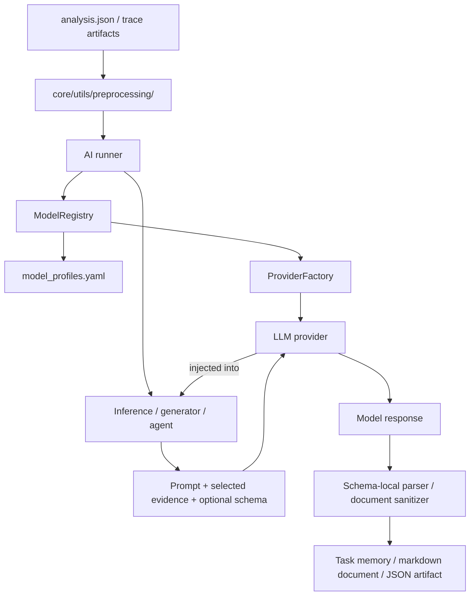
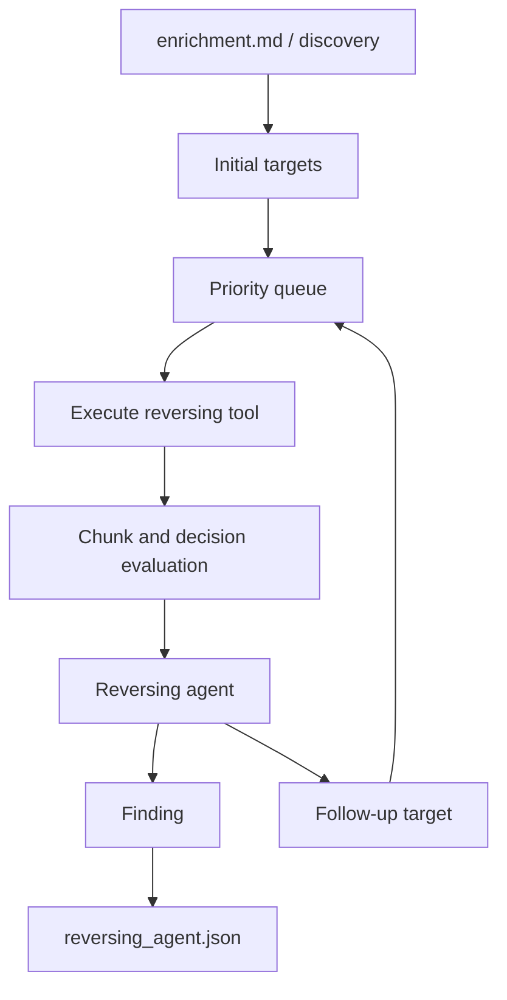

# AI

AIM's AI layer reads evidence produced by deterministic phases and turns it into
structured findings, enrichment notes, reverse engineering decisions, and final
report text.

The AI layer is intentionally separated from tools:

- tools collect and parse evidence;
- preprocessing selects model inputs;
- AI runners control workflow state;
- inference or agent classes build prompts and parse decisions;
- providers handle model API differences.

## Flow


```mermaid
flowchart TD
    Artifacts[analysis.json / trace artifacts] --> Preprocessing[core/utils/preprocessing/]
    Preprocessing --> Runner[AI runner]

    Runner --> Registry[ModelRegistry]
    Registry --> Profiles[model_profiles.yaml]
    Registry --> Factory[ProviderFactory]
    Factory --> Provider[LLM provider]

    Runner --> Inference[Inference / generator / agent]
    Provider -- injected into --> Inference

    Inference --> Request[Prompt + selected evidence + optional schema]
    Request --> Provider

    Provider --> Response[Model response]
    Response --> Parsing[Schema-local parser / document sanitizer]
    Parsing --> Output[Task memory / markdown document / JSON artifact]
```

## Directory Layout

```text
core/ai/
    agents/
    inferences/
    providers/
    runner/
    runtime/
    schemas/
    model_profiles.yaml
    model_registry.py
```

| Directory | Purpose |
| --- | --- |
| `agents/` | Agent prompt logic, currently the reversing agent |
| `inferences/` | Task-specific prompt logic for static, dynamic, enrichment, and report |
| `providers/` | Ollama, OpenAI-compatible, and Gemini HTTP clients |
| `runner/` | Workflow orchestration for each AI task |
| `runtime/` | Tool execution helpers, inference memories, and reversing agent runtime |
| `schemas/` | JSON schemas and response parsing helpers |

## Model Profiles

AI model selection is configured in:

```text
core/ai/model_profiles.yaml
```

The file has four main sections:

| Section | Purpose |
| --- | --- |
| `providers` | Defines provider type, base URL, and optional API key source |
| `profiles` | Defines model, temperature, response format, and provider |
| `tasks` | Selects the default profile for task runners |
| `agents` | Selects the default profile for agent runners |

The registry resolves model clients through this chain:

```text
task or agent name -> default profile -> provider -> provider client
```

Profiles can read values from environment variables:

```yaml
model:
  env: GEMINI_DYNAMIC_MODEL
  default: "gemini-3.5-flash"
```

This allows the same code to run against local Ollama, OpenAI-compatible APIs,
or the native Gemini API.

## Registry and Factory

`ModelRegistry` lives in:

```text
core/ai/model_registry.py
```

It is responsible for:

- reading task and agent defaults;
- resolving profile overrides;
- validating profile/provider entries;
- creating provider clients through `ProviderFactory`.

`ProviderFactory` lives in:

```text
core/ai/providers/factory.py
```

It converts a profile and provider config into a concrete provider:

| Provider type | Client |
| --- | --- |
| `ollama` | `OllamaProvider` |
| `openai` | `OpenAICompatibleProvider` |
| `gemini` | `GeminiProvider` |

The rest of the AI layer receives only the shared provider interface, so runners
and inference classes do not need provider-specific branches.

Runners may still adapt how evidence is batched before it reaches the model.
Local SLM profiles favor smaller chunks. Cloud profiles such as `openai` and
`gemini` favor fewer calls, so enrichment and report sources are grouped by
phase before being sent to the model.

## Providers

Providers live in:

```text
core/ai/providers/
```

The shared interface is defined in `base.py`:

- `chat`
- `chat_json`
- `chat_with_assistant`
- `chat_json_with_assistant`

`OllamaProvider` sends requests to:

```text
/api/chat
```

When a JSON schema is supplied, Ollama receives it in the `format` field. This
is why schemas matter for local SLM execution: they give Ollama a concrete JSON
shape to produce.

`OpenAICompatibleProvider` sends requests to:

```text
/chat/completions
```

When a JSON schema is supplied, it is sent through `response_format`.
OpenAI-compatible providers use strict `json_schema` formatting.

`GeminiProvider` sends requests to the native Gemini Interactions API:

```text
/interactions
```

Gemini receives the system prompt through `system_instruction`, the user-facing
prompt through `input`, and JSON schemas through its native `response_format`
shape:

```text
type: text
mime_type: application/json
schema: ...
```

## Schemas

Schemas live in:

```text
core/ai/schemas/
```

They serve two purposes:

1. Give JSON-capable providers, especially Ollama, an explicit response shape.
2. Validate or normalize model responses before runners persist them.

Important files:

| File | Purpose |
| --- | --- |
| `static.py` | Static inference schema, parser, and fallback response |
| `dynamic.py` | Dynamic behavior inference schema, parser, and fallback response |
| `reversing.py` | Reversing finding schema used by the model-callable finding tool |
| `report.py` | Structured report schema and final assessment validation |

Each schema file owns the parser for the response it describes. This keeps the
contract, validation, and fallback behavior together. If a static, dynamic, or
reversing model returns empty text, invalid JSON, missing keys, or wrong
confidence values, AIM records a low-confidence fallback instead of crashing the
whole run.

The report schema is stricter. Its final structured response must contain
`report_markdown` and `assessment`. AIM validates the assessment fields before
writing `report.md` and `assessment.json`; invalid structured report responses
are retried once and are not persisted if validation still fails.

In the report assessment, `family` and `categories` have different meanings.
`family` is only for a concrete malware family or malicious tool name, such as
`AgentTesla`, `Emotet`, `TrickBot`, `QakBot`, `RedLine`, `AsyncRAT`, `LockBit`,
or `DarkGate`. If the evidence only supports a broad type, `family` stays
`null`.

`categories` stores the broad malware type, objective, or capability labels,
such as `ransomware`, `credential_stealer`, `information_stealer`, `keylogger`,
`remote_access_trojan`, `downloader`, `dropper`, `backdoor`, `spyware`, `bot`,
`banking_trojan`, `wiper`, `cryptominer`, or `loader`.

## Runtime

Runtime helpers live in:

```text
core/ai/runtime/
```

They are shared by AI runners and agents.

| File | Purpose |
| --- | --- |
| `executor.py` | Executes validated agent tool calls |
| `tool_validator.py` | Validates model-requested tool parameters against tool schemas |
| `inference/` | Static and dynamic inference memory writers |
| `reversing/` | Reversing agent analysis, memory, queue, initialization, exploration, target validation, and trace formatting |

Inference memories are intentionally small and task-specific:

- `runtime/inference/memory.py` contains the shared inference trace writer;
- `runtime/inference/static_memory.py` writes `static_inference.json`;
- `runtime/inference/dynamic_memory.py` writes `dynamic_inference.json`.

Both store compact `steps`, global `findings`, `findings_count`, and `errors`.
Each step contains:

```json
{
  "step": 1,
  "input": {},
  "analysis": {
    "thought": "...",
    "confidence": "high"
  },
  "finding": null,
  "error": null
}
```

They do not store agent-style tool blocks or priority queues.

The reversing agent has its own memory and formatter:

```text
core/ai/runtime/reversing/memory.py
core/ai/runtime/reversing/analysis.py
core/ai/runtime/reversing/decision.py
core/ai/runtime/reversing/trace_formatter.py
```

`ReversingAgentMemory` stores steps, findings, queue events, errors, final
status, and a compact summary. `ReversingTraceFormatter` owns the JSON shape for
step input, decision, action, findings, follow-ups, queue validation, and
origin fields.

`ReversingEvidenceAnalyzer` owns model-call policy for one reversing evidence
chunk. If a chunk fails with enrichment context, it retries with the enrichment
removed before returning a failed decision. This retry is intentionally in the
reversing runtime because it changes the model input; provider transport
retries only repeat equivalent HTTP/model requests.

`ReversingDecisionEvaluator` coordinates the executed tool output: it chunks
the output, asks the analyzer for a model decision, postprocesses findings, and
queues follow-up targets.

The reversing runtime adds the bounded agent loop:


```mermaid
flowchart TD
    Context[enrichment.md / discovery] --> Seed[Initial targets]
    Seed --> Queue[Priority queue]
    Queue --> Tool[Execute reversing tool]
    Tool --> Decision[Chunk and decision evaluation]
    Decision --> Agent[Reversing agent]
    Agent --> Finding[Finding]
    Agent --> FollowUp[Follow-up target]
    FollowUp --> Queue
    Finding --> Memory[reversing_agent.json]
```

1. initialize targets from enrichment or focused discovery;
2. push targets into a priority queue;
3. execute the highest-priority unvisited target;
4. split large evidence into chunks;
5. evaluate each chunk;
6. record findings;
7. enqueue follow-up targets when useful.

The reversing trace is written to `reversing_agent.json`. Each step keeps the
model decision separate from the executed action:

```json
{
  "input": {
    "type": "code",
    "target": "0x402068",
    "chunk": 1,
    "total_chunks": 2,
    "total_instructions": 71
  },
  "decision": {
    "thought": "The code region resolves APIs dynamically.",
    "confidence": "high"
  },
  "action": {
    "tool": "disassembly",
    "target": "0x402068",
    "status": "ok"
  },
  "follow_ups": []
}
```

Normal queue validations are serialized as `"VALID"`. Corrections and
rejections keep compact details so analysts can see what the validator changed
without reading the full internal target object.

## Inference Models

Inference classes live in:

```text
core/ai/inferences/
```

They are responsible for prompt construction and response parsing. They do not
own persistence or pipeline state.

| Class | Purpose |
| --- | --- |
| `StaticInference` | Looks for natural-language threat messages in strings |
| `DynamicInference` | Looks for behavioral findings in dynamic evidence sections |
| `EnrichmentGenerator` | Updates the enrichment document from prior outputs |
| `ReportGenerator` | Updates the final report and produces the final structured assessment |

The matching runners live in `core/ai/runner/` and own the workflow around each
inference class.

`ReportGenerator` uses separate prompt modes:

- incremental updates return Markdown only;
- the final pass returns structured JSON with `report_markdown` and `assessment`.

This prevents JSON-only structured-output instructions from leaking into normal
Markdown report updates.

## Agents

Agents live in:

```text
core/ai/agents/
```

The current agent is:

```text
core/ai/agents/reversing.py
```

The reversing agent differs from simple inference:

- it can request tool actions;
- it works with an explicit queue;
- it reads tool contracts;
- it records queue events and tool decisions;
- it must ground findings in executable-code evidence.
- when a finding is generated from disassembly, evidence should include at
  least one instruction address and instruction text.

The model-callable reversing tools are defined outside the AI layer:

```text
core/tools/reversing/agent.py
core/tools/reversing/agent_tools.json
```

The AI runtime validates model actions against that JSON contract before any
tool is executed.

The agent uses native tool calling from the configured provider. The internal
target queue receives validated targets after target validation; the
provider-specific transport is kept inside the provider layer.

## Adding an AI Task

To add a new model-backed task:

1. Add schemas and response parsers under `core/ai/schemas/` if the task expects JSON.
2. Add prompt and task logic under `core/ai/inferences/`.
3. Add a runner under `core/ai/runner/`.
4. Add preprocessing helpers under `core/utils/preprocessing/` if the raw
   artifacts need selection, chunking, or compaction.
5. Register a default task profile in `core/ai/model_profiles.yaml`.
6. Call the runner from the orchestrator or from an existing phase.

## Adding an Agent

To add an agent:

1. Add agent prompt logic under `core/ai/agents/`.
2. Add tool contracts under the relevant `core/tools/<phase>/` directory.
3. Add or reuse runtime helpers for queueing, memory, and validation.
4. Add a runner under `core/ai/runner/`.
5. Register the default agent profile in `core/ai/model_profiles.yaml`.
6. Ensure findings are postprocessed and grounded before being persisted.

## Adding a Provider

To add a provider:

1. Implement the shared provider interface in `core/ai/providers/`.
2. Register the provider type in `ProviderFactory`.
3. Add provider configuration to `core/ai/model_profiles.yaml`.
4. Add one or more profiles using that provider.

Keep provider differences inside `core/ai/providers/`. Runners and inference
classes should continue using only the shared interface.
