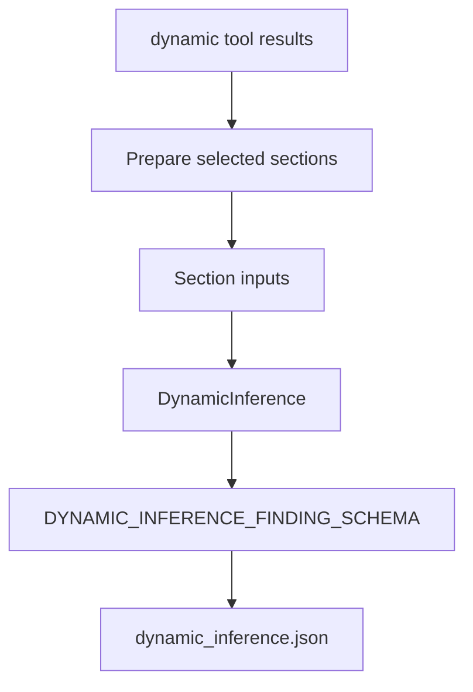

# Dynamic AI

Dynamic AI inference looks for malware-analysis-relevant behavior in selected
dynamic evidence from Procmon, Autoruns, and registry diffing.

## Files

```text
core/ai/inferences/dynamic.py
core/ai/runner/dynamic.py
core/ai/schemas/dynamic.py
core/ai/runtime/inference/dynamic_memory.py
core/utils/preprocessing/dynamic/
```

## Flow



`DynamicInferenceRunner` prepares selected dynamic evidence sections and sends
each section to `DynamicInference`. If no dynamic evidence is available, it
skips inference.

## Model Task

`DynamicInference` analyzes one selected evidence section at a time. It reports
findings for concrete behavior such as:

- persistence or autorun changes;
- registry modifications;
- file creation, modification, deletion, or rename behavior;
- process execution or notable image loading;
- DNS, TCP, or UDP activity;
- ransomware-style activity such as ransom note creation, many file writes, or
  recovery/safety-control tampering.

Autoruns and registry evidence are treated as before/after diffs. Procmon
sections may contain selected items from a larger artifact, so the prompt uses
coverage fields such as `index`, `total_chunks`, `total_items`, and
`selected_count` when available.

## Deduplication

The runner passes existing finding summaries to the model. The prompt asks the
model to avoid repeating the same behavior, impact, and evidence pattern with
different wording.

## Output

The model returns JSON matching `DYNAMIC_INFERENCE_FINDING_SCHEMA`. Valid
findings include:

- `category`
- `summary`
- `evidence`

Evidence must be short concrete observations from the supplied dynamic evidence.
Source metadata is stored separately and should not be duplicated inside
evidence.

Dynamic inference memory stores compact `steps`, global `findings`,
`findings_count`, and `errors` in:

```text
dynamic_inference.json
```

It does not use agent-style queues or tool calls.
