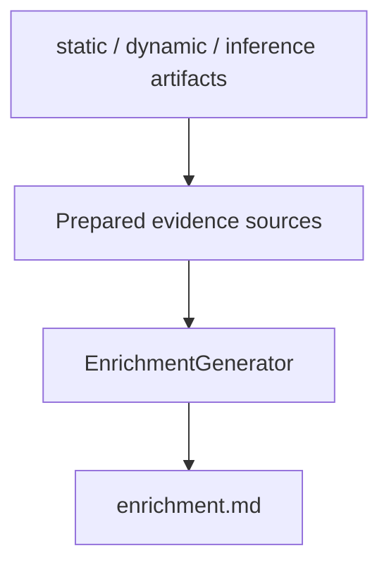

# Enrichment AI

Enrichment AI builds and updates a compact reverse-engineering enrichment
document. The document is designed to guide later reversing, not to be the final
malware report.

## Files

```text
core/ai/inferences/enrichment.py
core/ai/runner/enrichment.py
core/utils/preprocessing/
core/utils/artifacts/documents.py
```

## Flow



`EnrichmentAIRunner` reads deterministic outputs and AI findings, prepares
evidence sources, and incrementally updates `enrichment.md`.

## Model Task

`EnrichmentGenerator` extracts technical pivots useful for reverse engineering.
It focuses on evidence-backed items such as:

- binary layout, entrypoints, sections, permissions, sizes, and entropy;
- interesting imports and APIs;
- interesting strings and artifacts;
- file names, registry keys, mutexes, services, command lines, URLs, domains,
  wallets, and network indicators;
- functions or code paths worth investigating;
- likely routines for configuration loading, encryption, decoding, persistence,
  injection, network communication, collection, exfiltration, or destruction.

The enrichment prompt explicitly avoids report-style conclusions, unsupported
classification, malware family attribution, and VirusTotal label-driven claims.

## Output

The model returns Markdown body only. The runner owns the document title and
document persistence.

Output is stored in:

```text
enrichment.md
```

The document should stay compact and actionable. Concrete observables are wrapped
in backticks, and source labels such as `static.*` or `dynamic.*` are not treated
as malware evidence.
