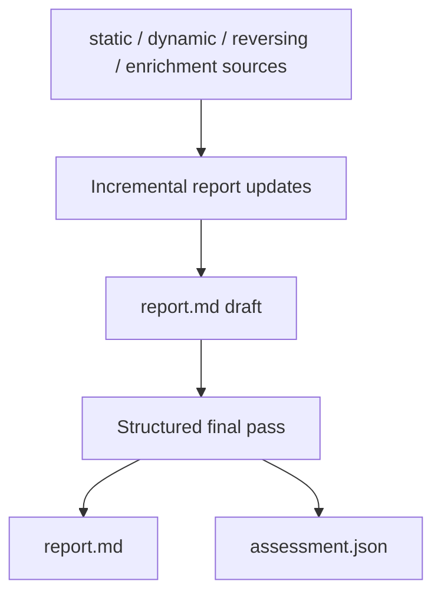

# Report AI

Report AI produces the analyst-facing malware analysis report and the final
machine-readable assessment.

## Files

```text
core/ai/inferences/report.py
core/ai/runner/report.py
core/ai/schemas/report.py
core/utils/preprocessing/report.py
core/utils/postprocessing/assessment.py
```

## Flow



`ReportAIRunner` collects prepared evidence sources, incrementally updates the
Markdown report, and then performs a final structured pass.

## Incremental Updates

`ReportGenerator.update_report()` uses assistant history to maintain the current
report. Incremental updates return Markdown only. They integrate new evidence
into semantic report sections rather than creating headings named after tools or
source files.

The update prompt requires grounded conclusions and preserves useful existing
content. If a source adds nothing useful, the model may return the existing
report unchanged.

## Final Assessment

`ReportGenerator.finalize_report()` converts the current report into structured
JSON matching `REPORT_SCHEMA`. The response must include:

- `report_markdown`
- `assessment`

The final assessment decides whether the sample is malicious, the confidence in
that verdict, any concrete malware family or malicious tool attribution, broad
behavioral categories, and a concise summary reason.

`family` is only for a concrete malware family or malicious tool name, such as
`AgentTesla`, `Emotet`, `TrickBot`, `QakBot`, `RedLine`, `AsyncRAT`, `LockBit`,
or `DarkGate`. If the evidence only supports a broad type, `family` stays
`null`.

`categories` stores broad malware types, objectives, or capability labels such
as `ransomware`, `credential_stealer`, `information_stealer`, `keylogger`,
`remote_access_trojan`, `downloader`, `dropper`, `backdoor`, `spyware`, `bot`,
`banking_trojan`, `wiper`, `cryptominer`, or `loader`.

Invalid structured report responses are retried once. If validation still fails,
the invalid final response is not persisted.

## Output

Report output is stored in:

```text
report.md
assessment.json
```
