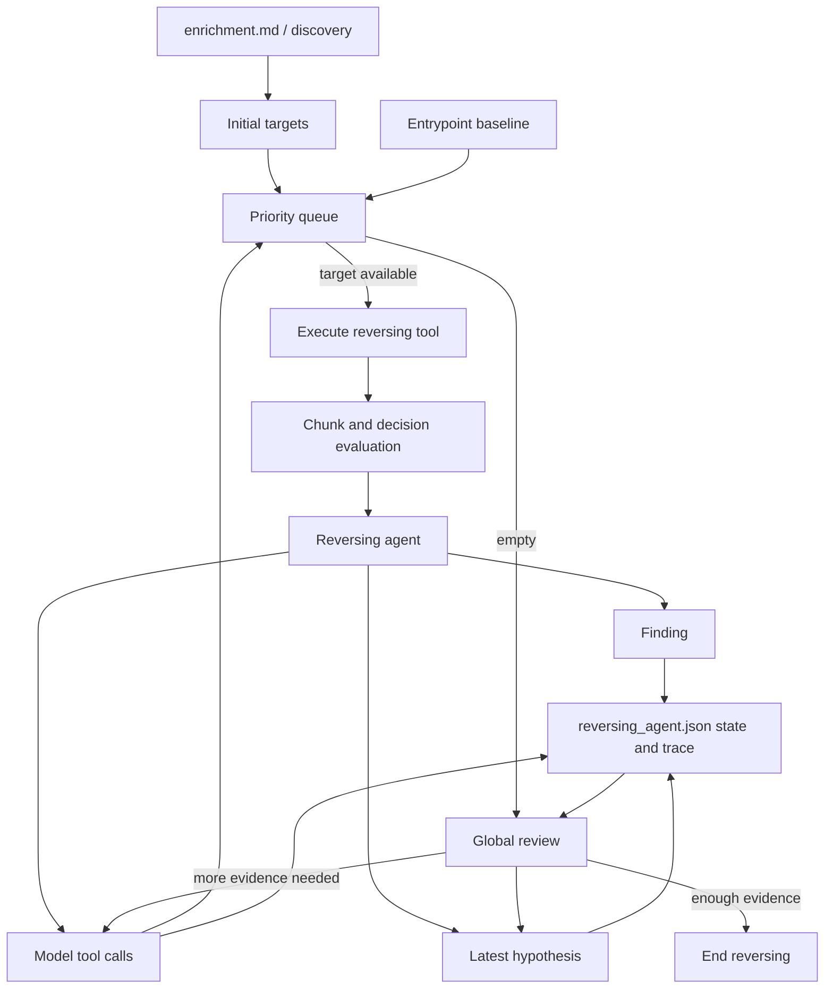

# Reversing Agent

The reversing agent performs bounded, queue-driven reverse engineering. It uses
model-selected investigation `tool_calls`, validates them, executes reversing
tools, records findings, and reviews global progress when the queue is empty.

## Files

```text
core/ai/agents/reversing.py
core/ai/runner/reversing.py
core/ai/runtime/reversing/
core/utils/postprocessing/reversing/
core/tools/reversing/agent.py
core/tools/reversing/agent_tools.json
```

## Runtime Components

`ReversingAgentMemory` stores steps, findings, queue events, errors, final
status, compact factual state, and the latest model hypothesis.

`ReversingTraceFormatter` owns the JSON shape for step input, decision,
findings, tool calls, queue validation, and origin fields.

`ReversingEvidenceAnalyzer` owns model-call policy for one reversing evidence
chunk. The local analysis prompt receives only the current target, current tool
output summary, and current bounded raw output chunk. Enrichment is used only to
create initial targets, and accumulated findings are reserved for global review.
Local chunk analysis may update the latest hypothesis from the current tool
output only.

`ReversingDecisionEvaluator` coordinates executed tool output: it chunks the
output, asks the analyzer for a model decision, postprocesses findings, and
queues model-selected tool calls. When the queue becomes empty, it performs a
separate global review call with factual state, recorded findings, and the
latest model hypothesis.

`ReversingModelOutputCleaner` is a conservative repair step for local models
that sometimes write a finding JSON object inside the summary text. It only
recovers parseable JSON findings and replaces noisy summary text with a short
fallback note.

## Flow



1. Initialize targets from enrichment or focused discovery.
2. Add a small entrypoint baseline when a valid entrypoint can be resolved.
3. Push targets into a priority queue.
4. Execute the highest-priority unvisited target.
5. Split large evidence into chunks.
6. Evaluate each chunk independently.
7. Clean model output and validate findings.
8. Enqueue model-selected tool calls when useful.
9. Update the latest hypothesis from parseable model output.
10. Run global review when the queue is empty.

## Tool Calls

The agent reads native tool calls from the configured provider when present. The
current prompts also allow a final `tool_calls:` JSON line in message content,
which is useful for local models that express intended calls more reliably in
text. Both sources are normalized into the same compact target format before
validation.

Step `tool_calls` store the model-selected calls before queue validation. Queue
events show whether each call was added, corrected, or rejected.

Model-selected tool calls are compact targets:

```json
{
  "tool": "disassembly",
  "target": "0x4068d0",
  "priority": 75
}
```

The model-callable reversing tools are defined outside the AI layer:

```text
core/tools/reversing/agent.py
core/tools/reversing/agent_tools.json
```

The AI runtime validates model-selected tool calls against that JSON contract
before any tool is executed.

## Local Analysis

The local `analyze_evidence()` prompt is intentionally narrow. It receives:

- the current input target;
- a compact summary of the current tool output;
- the current bounded raw tool chunk.

It does not receive enrichment, global state, previous hypotheses, or
accumulated findings as local evidence.

Findings must be grounded in the current tool output. Prologue/epilogue code,
generic register or stack setup, arithmetic, generic control flow, and
unresolved calls are normally context, not findings. Findings generated from
disassembly should include direct code evidence such as instruction addresses
plus instruction text.

## Global Review

When the queue becomes empty, AIM performs a separate global review model call.
That call receives factual state, recorded findings, and the current model
hypothesis. It decides whether more investigation is likely to materially
improve the result. If so, its `tool_calls` are validated, deduplicated, and
returned to the normal queue. If not, reversing ends.

The persisted runtime `state` includes queue size for the analyst-facing trace.
The compact state passed to global review includes only:

- `steps`
- `findings`
- `errors`
- `discovery`
- `explored`

Queue size is omitted because review runs only after the local queue is empty.

## Output

The reversing trace is written to:

```text
reversing_agent.json
```

Runtime state is factual and separate from the model-generated hypothesis:

```json
{
  "state": {
    "steps": 17,
    "findings": 7,
    "errors": 0,
    "discovery": {
      "entrypoints": true,
      "functions": true,
      "imports": true,
      "sections": true
    },
    "explored": {
      "functions": 2,
      "imports": 1,
      "sections": 1
    },
    "queue": {
      "pending": 0
    }
  },
  "hypothesis": {
    "malware": true,
    "type": null,
    "confidence": "low"
  }
}
```

Each step records the executed tool directly in `input`. There is no separate
`action` block.

```json
{
  "input": {
    "tool": "disassembly",
    "target": "entry0",
    "chunk": 1,
    "total_chunks": 2,
    "total_instructions": 71,
    "status": "ok"
  },
  "decision": {
    "thinking": [
      "The call target controls the behavior of this branch."
    ],
    "summary": "The chunk needs one helper inspected to clarify the branch.",
    "confidence": "high"
  },
  "finding": null,
  "tool_calls": [
    {
      "tool": "disassembly",
      "target": "fcn.004065e0",
      "priority": 75
    }
  ],
  "error": null
}
```

Detailed model reasoning from Ollama is stored as `decision.thinking`, split
into one list item per thinking line. `decision.summary` is the short readable
decision summary from model content. Machine-readable `finding:`,
`hypothesis:`, and `tool_calls:` lines are parsed out of the summary before the
trace is written.

## Related Docs

- [Reverse engineering phase](../phases/reversing.md)
- [Reversing tools](../tools/reversing.md)
