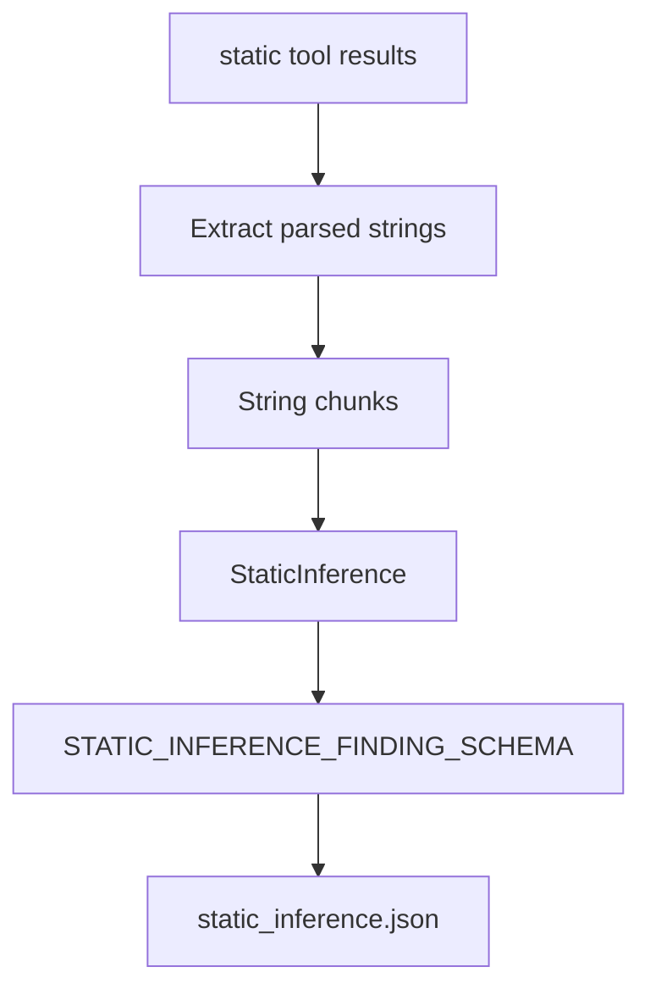

# Static AI

Static AI inference looks for victim-facing threat actor messages inside strings
extracted by deterministic static analysis.

## Files

```text
core/ai/inferences/static.py
core/ai/runner/static.py
core/ai/schemas/static.py
core/ai/runtime/inference/static_memory.py
core/utils/preprocessing/static/
```

## Flow



`StaticInferenceRunner` reads static tool results, extracts parsed strings, and
processes them in chunks. It skips inference when no parsed strings are
available.

## Model Task

`StaticInference` asks the model to identify only explicit messages written by
the malware operator for a victim. Examples include ransom notes, extortion
messages, payment instructions, contact instructions, and decryption guidance.

The prompt prefers false negatives over false positives. It rejects random or
high-entropy strings, API names, DLL names, registry paths, compiler metadata,
debug strings, and generic technical strings.

## Output

The model returns JSON matching `STATIC_INFERENCE_FINDING_SCHEMA`. Valid
findings include:

- `category`
- `tone`
- `summary`
- `evidence`

Evidence must be copied from the supplied string chunk and must directly support
the finding.

Static inference memory stores compact `steps`, global `findings`,
`findings_count`, and `errors` in:

```text
static_inference.json
```

Each step stores the selected input, a short `analysis.thought`, confidence, an
optional finding, and an optional error. It does not use agent-style queues or
tool calls.
