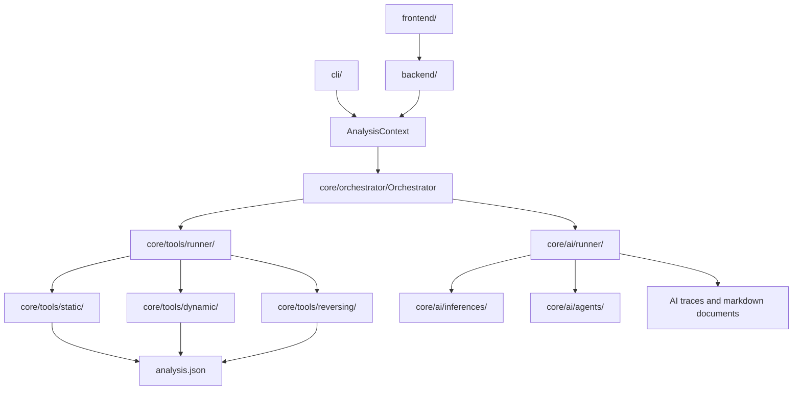

# Architecture

AIM is organized around a small core analysis engine. The CLI and backend create
requests, the orchestrator decides which phase to run, runners execute tools or
AI workflows, and artifacts are written back to the sample output directory.

## System Overview



The main boundary is simple:

- `core/orchestrator/` coordinates phases.
- `core/tools/` runs deterministic tools.
- `core/ai/` runs model-backed inference, enrichment, reporting, and agents.
- `core/utils/` contains artifact IO, preprocessing, postprocessing, and shared
  support code.

## Orchestrator

The orchestrator lives in:

```text
core/orchestrator/
```

Important files:

| File | Purpose |
| --- | --- |
| `context.py` | Builds `AnalysisContext` from CLI/backend arguments |
| `orchestrator.py` | Coordinates phases and delegates work to runners |
| `event.py` | Defines pipeline events used by backend/web execution |

`AnalysisContext` is the normalized execution contract. It resolves the sample
path, calculates the sample SHA-256, creates the output directory, and stores
phase options such as selected tools, model profile, dynamic filter, reversing
target, and full-pipeline profile overrides.

For the end-to-end phase order and what each phase produces, see
[Phases](../phases/README.md).

`Orchestrator` is intentionally a coordinator. It does not implement analyzers,
prompts, model HTTP calls, or artifact parsing. It:

- selects the requested phase;
- creates phase-specific contexts for full pipeline stages;
- invokes tool runners;
- invokes AI runners when enabled;
- persists deterministic tool results through `JsonBuilder`;
- emits pipeline events when used by the backend.

Supported phase handlers:

| Phase | Handler |
| --- | --- |
| `static` | `run_static_phase` |
| `dynamic` | `run_dynamic_phase` |
| `enrichment` | `run_enrichment_phase` |
| `reversing` | `run_reversing_phase` |
| `report` | `run_report_phase` |
| `full` | `run_full_phase` |

The full pipeline is explicit and sequential:

```text
static tools
  -> static strings inference
  -> dynamic tools
  -> dynamic inference
  -> enrichment
  -> reversing info tools
  -> reversing agent
  -> report
```

This keeps the phase order visible and makes each stage replaceable without
putting tool or model logic inside the orchestrator.

The orchestrator only coordinates tool execution. Tool implementation details
and phase-specific tool lists are documented in [Tools](../tools/README.md).

## Runners

Runners are the execution layer below the orchestrator.

### Tool Runners

Tool runners live in:

```text
core/tools/runner/
```

They execute the mappings described in [Tools](../tools/README.md).

| Runner | Purpose |
| --- | --- |
| `StaticToolRunner` | Executes registered static analyzers |
| `DynamicToolRunner` | Prepares VMs, writes dynamic jobs, waits for artifacts, parses dynamic results, and shuts VMs down |
| `ReversingToolRunner` | Executes manual reversing tools |
| `ReversingAgentToolRunner` | Exposes reversing tools to the AI reversing agent |

Tool runners return dictionaries of `ToolResult` objects. A normal tool result
has this shape:

```json
{
  "status": "ok",
  "data": {},
  "error": null
}
```

Failures are captured per tool:

```json
{
  "status": "error",
  "data": null,
  "error": "error message"
}
```

This lets one failed tool coexist with successful results from the same phase.

### AI Runners

AI runners live in:

```text
core/ai/runner/
```

| Runner | Output |
| --- | --- |
| `StaticInferenceRunner` | `static_strings_inference.json` |
| `DynamicInferenceRunner` | `dynamic_inference.json` |
| `EnrichmentAIRunner` | `enrichment.md` |
| `ReportAIRunner` | `report.md` |
| `ReversingAgentRunner` | `reverse_agent.json` |

AI runners own workflow state and persistence for their specific task. They use
preprocessing helpers to select model inputs, call an inference/generator/agent,
and save traces or markdown documents. They do not run deterministic tools
directly.

## AI Architecture

The architecture-level rule is that AI runners consume prepared evidence and
delegate model access to the AI provider layer. Provider selection, schemas,
runtime memory, inference classes, and agents are documented in
[AI](../ai/README.md).

## Tool Architecture

Tools are organized by analysis phase:

```text
core/tools/
    static/
    dynamic/
    reversing/
    runner/
    results.py
```

The implementation pattern, manual mappings, agent mappings, and per-phase tool
descriptions are documented in [Tools](../tools/README.md). This section only
shows where that layer connects to the rest of the architecture.

### Static Tools

```text
core/tools/static/
    analyzers/
    manual.py
```

`manual.py` registers deterministic static tools:

| Tool | Analyzer |
| --- | --- |
| `file` | file type |
| `metadata` | file metadata |
| `hash` | hashes |
| `packer` | packer indicators |
| `strings` | string extraction |
| `pe` | PE parsing |
| `vt` | VirusTotal lookup |

`StaticToolRunner` resolves `full` into the registered static tools and executes
them one by one.

### Dynamic Tools

```text
core/tools/dynamic/
    agents/
    analyzers/
    virtualbox/
    manual.py
```

Dynamic analysis is split between host/Docker logic and VM agents:

- `virtualbox/` talks to the host-side VirtualBox Manager API.
- `analyzers/job.py` builds `job.json`, prepares shared-folder inputs, waits for
  artifacts, and parses returned artifacts.
- `analyzers/` contains parsers/job builders for Autoruns, Registry, and
  Procmon.
- `agents/remnux/receiver.py` receives artifacts in REMnux.
- `agents/windows7/collector.py` and `monitor.py` run inside the Windows victim.

`manual.py` registers dynamic job builders:

| Tool | Purpose |
| --- | --- |
| `autoruns` | Autoruns CSV before/after collection |
| `registry` | `reg.exe` registry exports before/after collection |
| `procmon` | Procmon capture and CSV conversion |

`DynamicToolRunner` prepares the VM session, writes the execution inputs,
waits for artifacts, parses them into `analysis.json`, and shuts the VMs down.

### Reversing Tools

```text
core/tools/reversing/
    analyzers/
    manual.py
    agent.py
    agent_tools.json
```

Manual reversing tools are registered in `manual.py`. Model-callable reversing
tools are registered separately in `agent.py` and described by
`agent_tools.json`.

This separation matters because CLI/manual reversing and AI agent tool calls use
different contracts even when they reuse the same lower-level analyzers.

## Artifact Flow

Deterministic tool output is stored in:

```text
analysis.json
```

The file is updated by phase and tool name. Existing phases are preserved, and
rerunning one tool replaces only that tool's current result.

AI workflows store separate artifacts because they contain decisions, findings,
evidence references, queue events, and generated prose:

| Artifact | Source |
| --- | --- |
| `static_strings_inference.json` | Static strings inference |
| `dynamic_inference.json` | Dynamic behavior inference |
| `reverse_agent.json` | Reversing agent |
| `enrichment.md` | Enrichment runner |
| `report.md` | Report runner |

## Extension Points

To add a new deterministic tool:

1. Add the analyzer under the phase-specific `core/tools/<phase>/analyzers/`
   directory.
2. Register it in the phase `manual.py`.
3. Ensure the phase runner can resolve it.
4. Return data that can be serialized into the `ToolResult` contract.

To add a new AI task:

1. Add prompts and task logic under `core/ai/inferences/` or `core/ai/agents/`.
2. Add an AI runner under `core/ai/runner/`.
3. Register the task in the AI configuration described in [AI](../ai/README.md).
4. Add an orchestrator phase or call it from an existing phase.

To add a new provider:

Follow the provider extension flow documented in [AI](../ai/README.md).
