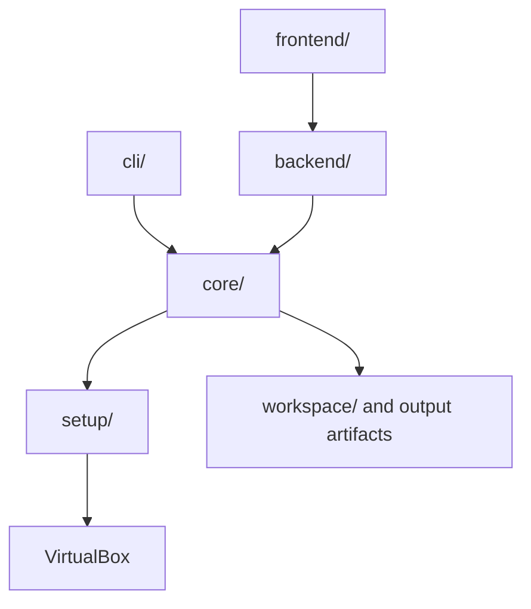

# Architecture

AIM is organized into separate layers so the CLI, backend, frontend, and core
analysis engine can evolve independently.

## Main Layers

| Layer | Responsibility |
| --- | --- |
| `core/` | Analysis orchestration, tool runners, AI runners, preprocessing, postprocessing |
| `cli/` | Command-line argument parsing |
| `backend/` | FastAPI API, web pipeline execution, artifact access |
| `frontend/` | React + TypeScript user interface |
| `setup/` | VirtualBox host API and VM management |
| `docs/` | Markdown documentation |

## Existing Detailed References

- [Orchestrator and runners](../orchestrator-and-runners.md)
- [Dynamic analysis setup](../dynamic-analysis.md)
- [Reversing agent](../reversing-agent.md)

TODO: Add a detailed package-by-package architecture reference.
