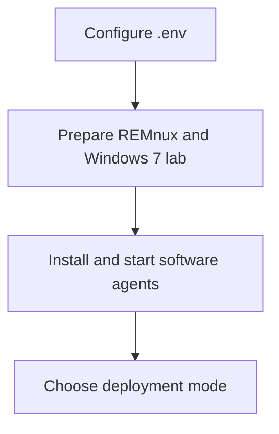

# Getting Started

This section walks through the minimum setup required to run AIM and prepare a
dynamic malware analysis lab.

Recommended order:

1. Configure the project.
2. Prepare the malware lab.
3. Configure the agents.
4. Choose a deployment mode.

## Documents

- [Configuration](configuration.md)
- [Malware Lab](malware-lab.md)
- [Agents](software-agents.md)
- [Deployment](deployment.md)

