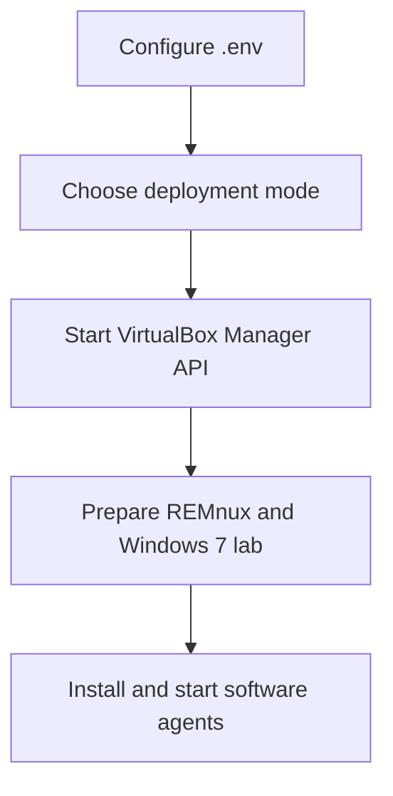

# Getting Started

This section walks through the minimum setup required to run AIM and prepare a
dynamic malware analysis lab.

Recommended order:

1. Configure the project.
2. Choose a deployment mode.
3. Start the VirtualBox Manager API.
4. Prepare the malware lab.
5. Configure the agents.

## Documents

- [Configuration](configuration.md)
- [Deployment](deployment.md)
- [VirtualBox Manager API](virtualbox-manager.md)
- [Malware Lab](malware-lab.md)
- [Agents](software-agents.md)

