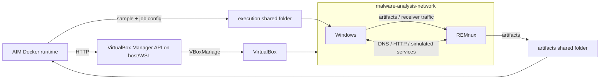

# Malware Lab

The dynamic analysis lab uses two VirtualBox virtual machines:

- REMnux analysis VM
- Windows 7 victim VM

Docker does not control VirtualBox directly. AIM talks from Docker to the
host-side VirtualBox Manager API, and that API controls the VMs, snapshots, and
shared folders.

## Runtime Flow

The dynamic flow is:

1. Docker reaches the VirtualBox Manager API running on the host or WSL.
2. The VirtualBox Manager API starts and restores the configured VMs.
3. VirtualBox exposes the configured shared folders to the VMs.
4. Docker writes the malware sample and tool configuration into the execution
   shared folder.
5. The Windows victim reads the execution shared folder and runs the collector
   and monitor agents.
6. REMnux receives artifacts from Windows and writes them into the artifacts
   shared folder.
7. Docker reads the artifacts from the shared folder and continues the dynamic
   postprocessing and AI inference pipeline.



## VirtualBox Network

Use one internal network shared by both VMs:

```text
malware-analysis-network
```

Recommended addressing:

| VM | Interface | IP address | Mask | Gateway | DNS |
| --- | --- | --- | --- | --- | --- |
| REMnux | Internal adapter | `192.168.255.1` | `/24` | None | Optional |
| Windows 7 | Internal adapter | `192.168.255.3` | `255.255.255.0` | `192.168.255.1` | `192.168.255.1` |

REMnux acts as the controlled gateway and simulated internet endpoint for the
victim. The Windows VM should not have direct internet access.

## Windows VM Configuration

In VirtualBox:

1. Open the Windows VM settings.
2. Go to `Network`.
3. Enable one adapter for the victim.
4. Set `Attached to` to `Internal Network`.
5. Set `Name` to:

```text
malware-analysis-network
```

Inside Windows:

1. Open `Control Panel`.
2. Go to `Network and Sharing Center`.
3. Open `Change adapter settings`.
4. Right-click the corresponding `Local Area Connection`.
5. Open `Properties`.
6. Select `Internet Protocol Version 4 (TCP/IPv4)`.
7. Open `Properties`.
8. Configure:

```text
IP address:      192.168.255.3
Subnet mask:     255.255.255.0
Default gateway: 192.168.255.1
DNS server:      192.168.255.1
```

After configuring the Windows agent, shared folders, and networking, create a
clean snapshot. AIM restores the configured snapshot before dynamic execution.

## REMnux VM Configuration

In VirtualBox:

1. Configure adapter 1 as `NAT`.
2. Configure adapter 2 as `Internal Network`.
3. Set adapter 2 `Name` to:

```text
malware-analysis-network
```

Adapter 1 gives REMnux host or internet access when needed. Adapter 2 is the
isolated malware lab network.

Inside REMnux, configure Netplan. Edit:

```bash
sudo nano /etc/netplan/50-cloud-init.yaml
```

Use this structure, adjusting interface names if your VM uses different names:

```yaml
network:
  version: 2
  ethernets:
    enp0s3:
      dhcp4: true
    enp0s8:
      dhcp4: false
      dhcp6: false
      addresses: [192.168.255.1/24]
```

Apply the configuration:

```bash
sudo netplan apply
```

In this example, `enp0s3` is the NAT interface and `enp0s8` is the internal
malware lab interface.

## INetSim

INetSim should bind to the REMnux internal interface so malware traffic from the
Windows VM is contained inside the lab.

Edit:

```bash
sudo nano /etc/inetsim/inetsim.conf
```

Minimum useful settings:

```text
start_service dns
service_bind_address 192.168.255.1
dns_default_ip 192.168.255.1
dns_default_domainname algoinventado.com
```

These settings enable DNS, bind INetSim to the internal REMnux address, resolve
all DNS requests to REMnux, and use a custom default domain to make the lab less
obvious to simple checks.

Start INetSim manually:

```bash
sudo inetsim
```

To start INetSim automatically at boot, use the systemd service if available:

```bash
sudo systemctl enable --now inetsim
sudo systemctl status inetsim
```

If DNS starts but immediately stops on REMnux, see
[Troubleshooting: INetSim](../troubleshooting/README.md#inetsim).

## Snapshots

Create a clean snapshot after:

- Windows networking is configured.
- Windows AIM agents are installed.
- Shared folders are configured.
- REMnux networking is configured.
- REMnux receiver and INetSim setup are validated.

Configure the Windows snapshot name in `.env`:

```env
AIM_DYNAMIC_VICTIM_SNAPSHOT=Agent
```

The value must match the VirtualBox snapshot name exactly.

## Isolation Recommendations

- Keep the Windows victim on an internal-only network.
- Do not share host personal directories with the victim.
- Use dedicated execution and artifact shared folders.
- Revert to a clean snapshot before each run.
- Use REMnux as the controlled gateway for simulated services.
- Validate routing and DNS before executing real malware.

## Connectivity Checklist

- Docker can reach the host-side VirtualBox Manager API.
- The VirtualBox Manager API can start and restore both VMs.
- Windows can reach REMnux on `192.168.255.1`.
- Windows DNS points to `192.168.255.1`.
- Windows can reach the REMnux receiver URL.
- Windows can read the execution shared folder.
- REMnux can write to the artifacts shared folder.
- Docker can read the artifacts shared folder.
- INetSim is running if the sample needs simulated internet services.
