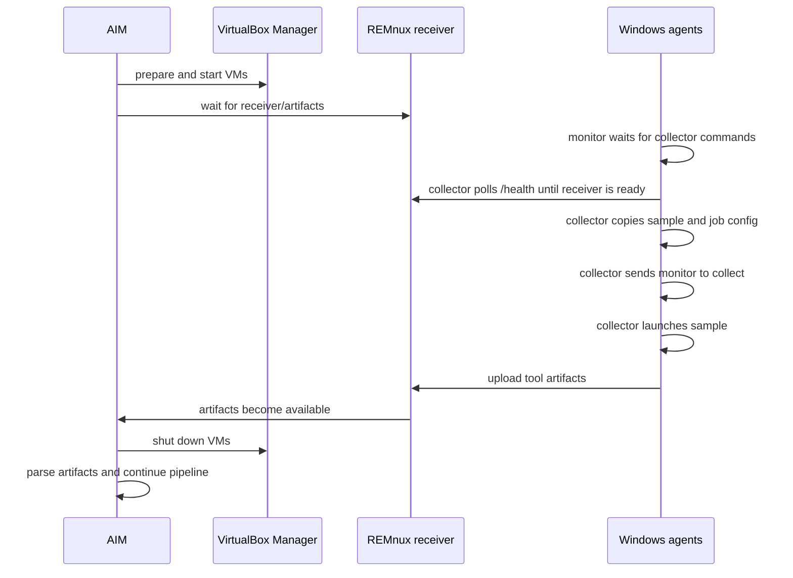

# Software Agents

AIM uses two dynamic agents:

- REMnux receiver agent.
- Windows execution agents.

Their purpose is to automate dynamic analysis while keeping collection and
parsing responsibilities separated.



## REMnux Agent

The REMnux receiver is located at:

```text
core/tools/dynamic/agents/remnux/receiver.py
```

Install it inside the REMnux VM. It receives artifacts uploaded by the Windows
side and stores them under the configured artifacts location.

Recommended receiver directory:

```bash
mkdir -p /home/remnux/Receiver
```

Install FastAPI and Uvicorn in the receiver environment:

```bash
cd /home/remnux/Receiver

python3 -m venv env
. env/bin/activate

pip install fastapi uvicorn
```

During testing, run it manually:

```bash
python receiver.py
```

The receiver listens on:

```text
0.0.0.0:8080
```

Configure AIM with the receiver URL:

```env
AIM_DYNAMIC_ANALYSIS_BASE_URL=http://192.168.255.1:8080
```

Use the IP address that is reachable from the Windows victim through the
internal network.

### REMnux Startup Service

For persistent execution, create a systemd unit for the receiver:

```bash
sudo nano /etc/systemd/system/aim-remnux-receiver.service
```

```ini
[Unit]
Description=AIM REMnux Dynamic Receiver
After=network-online.target vboxadd-service.service
Wants=network-online.target

[Service]
Type=simple
WorkingDirectory=/home/remnux/Receiver
ExecStart=/home/remnux/Receiver/env/bin/python /home/remnux/Receiver/receiver.py
Restart=always
RestartSec=5

[Install]
WantedBy=multi-user.target
```

Enable and start the receiver service:

```bash
sudo systemctl daemon-reload
sudo systemctl enable aim-remnux-receiver
sudo systemctl start aim-remnux-receiver
```

If your lab uses simulated network services, enable INetSim too:

```bash
sudo systemctl enable --now inetsim
```

## Windows Agents

The Windows agents are located at:

```text
core/tools/dynamic/agents/windows7/monitor.py
core/tools/dynamic/agents/windows7/collector.py
core/tools/dynamic/agents/windows7/start.bat
```

Recommended destination in the Windows VM:

```text
C:\AIM
```

Responsibilities:

| Agent | Responsibility |
| --- | --- |
| `monitor.py` | Long-lived local service that runs tool collection |
| `collector.py` | Waits for `job.json` and the malware sample, polls receiver `/health`, copies the sample, asks the monitor to collect, and launches the sample |
| `start.bat` | Convenience launcher for the monitor |

The Windows side reads the execution shared folder, receives `job.json` and the sample, and
uploads artifacts to the REMnux receiver.

### Windows Scheduled Tasks

For reliable execution, run the Windows agents as `SYSTEM` startup tasks.

Recommended monitor task:

```powershell
schtasks /Create /TN Monitor /TR C:\AIM\start.bat /SC ONSTART /RU SYSTEM
```

Alternative direct Python task:

```powershell
schtasks /Create /TN Monitor /TR C:\AIM\monitor.py /SC ONSTART /RU SYSTEM
```

Start the collector after a short delay:

```powershell
schtasks /Create /TN Collector /TR C:\AIM\collector.py /SC ONSTART /RU SYSTEM /DELAY 0000:05
```

If `.py` files are not associated with Python in the VM, point the scheduled
task action to the Python executable explicitly.

## Communication Model

The agents communicate through:

- the VirtualBox shared execution folder;
- the REMnux receiver HTTP endpoint;
- the internal VirtualBox network.

The host parses the artifacts after they are available. The Windows agent does
not parse or analyze tool output.

## Troubleshooting

For known operational issues and recovery steps, see
[Troubleshooting](../troubleshooting/README.md).
