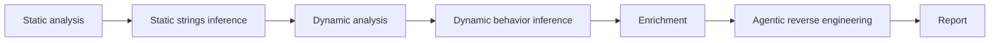

# Phases

AIM runs malware analysis as a sequence of deterministic phases and model-backed
inference phases. Deterministic phases collect evidence. AI components read
selected evidence and generate findings, enrichment notes, reverse engineering
guidance, or the final report.

## Phase Sequence

The `full` pipeline follows this order explicitly. Each stage writes artifacts
that later stages can reuse.

## Documents

- [Static analysis](static.md)
- [Dynamic analysis](dynamic.md)
- [Enrichment](enrichment.md)
- [Reverse engineering](reversing.md)
- [Report](report.md)

For the tool implementation pattern and the tools available in each phase, see
[Tools](../tools/README.md).

## Main Artifacts

| Artifact | Produced by |
| --- | --- |
| `analysis.json` | Deterministic static, dynamic, and reversing evidence |
| `static_strings_inference.json` | Static strings inference |
| `dynamic_inference.json` | Dynamic behavior inference |
| `enrichment.md` | Enrichment phase |
| `reverse_agent.json` | Agentic reverse engineering |
| `report.md` | Report phase |
