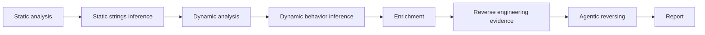
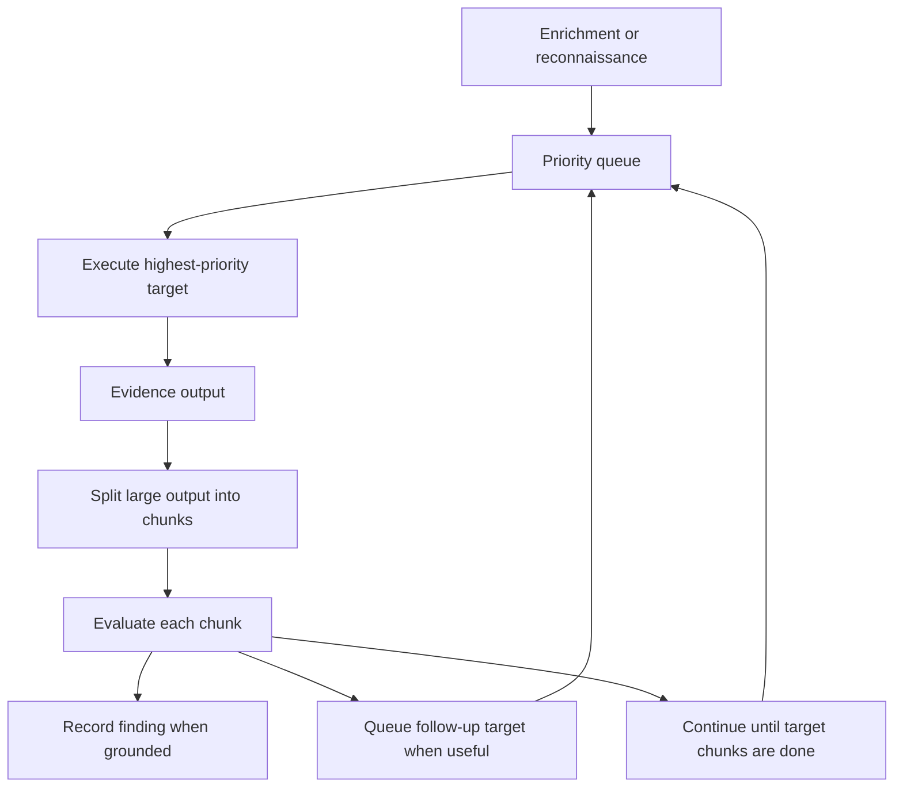

# Phases

AIM runs malware analysis as a sequence of deterministic phases and model-backed
inference phases. Deterministic phases collect evidence. AI components read
selected evidence and generate findings, enrichment notes, reversing guidance,
or the final report.

## Phase Sequence



The `full` pipeline follows this order explicitly. Each stage writes artifacts
that later stages can reuse.

## Static Analysis

Static analysis collects evidence from the sample without executing it. This
includes file metadata, hashes, packer indicators, strings, PE data, and
optional external context.

Outputs are stored under the `static` phase in:

```text
analysis.json
```

### Static Strings Inference

The static inference model focuses on strings that look like natural language.
Its main goal is to detect threat-facing text such as ransom notes, warnings,
payment instructions, intimidation messages, or other human-readable behavior
that may indicate operator intent.

The model receives prepared string chunks and stores structured findings in:

```text
static_strings_inference.json
```

## Dynamic Analysis

Dynamic analysis runs the sample inside the Windows victim VM and collects raw
behavior artifacts through the Windows agents and REMnux receiver.

Diff-oriented artifacts are reduced to meaningful before/after changes, while
runtime behavior artifacts are normalized into compact process, filesystem,
registry, and network sections. The dynamic model reads those prepared sections
and stores behavioral findings.

Dynamic evidence is stored under the `dynamic` phase in:

```text
analysis.json
```

Dynamic model findings are stored in:

```text
dynamic_inference.json
```

## Enrichment

Enrichment is a model-backed phase that reads the results of earlier phases and
builds a working document for the analyst and the reversing phase.

It reads deterministic outputs and AI findings from static and dynamic analysis,
then updates:

```text
enrichment.md
```

The goal is not to write the final report. The goal is to collect the most
important points of interest before reverse engineering starts: suspicious
strings, behavior patterns, dynamic findings, likely persistence points,
interesting network destinations, and hints about functions or imports worth
investigating.

## Reverse Engineering

Reverse engineering has two modes:

- deterministic reverse engineering;
- agentic reversing.

Deterministic reverse engineering gathers navigation and code evidence for the
sample. Agentic reversing uses that evidence through a bounded investigation
loop.

### Agentic Reversing

The reversing agent starts from `enrichment.md` when that document exists and
contains useful content. The enrichment document guides the first targets that
the agent puts into its investigation queue.

If enrichment is unavailable, the agent performs bounded reconnaissance and uses
deterministic fallback targets such as suspicious imports, large functions, and
interesting strings.

The agent is queue-driven:



For large assembly or xref outputs, AIM does not send everything in one prompt.
The evidence is recursively divided into bounded chunks. The agent evaluates all
chunks for the current target. If a chunk contains something interesting, the
agent can enqueue a follow-up target, but the current target's chunks continue
until finished. After that, the exploration loop pops the next highest-priority
unvisited target from the queue.

`--max-targets` limits unique queued targets executed by the agent. It does not
count evidence chunks as separate targets.

Agent output is stored in:

```text
reverse_agent.json
```

## Report

The report phase is similar to enrichment in the way it consumes previous
outputs, but its purpose is different.

Report generation reads:

- deterministic static evidence;
- static inference findings;
- dynamic parsed artifacts;
- dynamic inference findings;
- enrichment notes;
- reversing agent findings.

It incrementally updates:

```text
report.md
```

The report phase is the final analyst-facing document. It should summarize the
sample, preserve important evidence, explain observed behavior, and connect the
static, dynamic, enrichment, and reverse engineering results into one technical
narrative.

## Main Artifacts

| Artifact | Produced by |
| --- | --- |
| `analysis.json` | Deterministic static, dynamic, and reversing evidence |
| `static_strings_inference.json` | Static strings inference |
| `dynamic_inference.json` | Dynamic behavior inference |
| `enrichment.md` | Enrichment phase |
| `reverse_agent.json` | Agentic reversing |
| `report.md` | Report phase |

For the tool implementation pattern and the tools available in each phase, see
[Tools](../tools/README.md).
