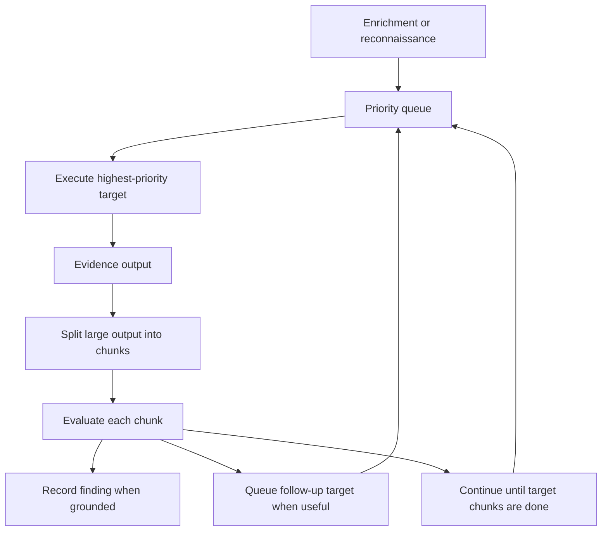

# Reverse Engineering

Reverse engineering has two modes:

- deterministic reverse engineering;
- agentic reverse engineering.

Deterministic reverse engineering gathers navigation and code evidence for the
sample. Agentic reverse engineering uses that evidence through a bounded
investigation loop.

## Agentic Reverse Engineering

The reversing agent starts from `enrichment.md` when that document exists and
contains useful content. The enrichment document guides the first targets that
the agent puts into its investigation queue.

If enrichment is unavailable, the agent performs bounded reconnaissance and uses
deterministic fallback targets such as suspicious imports, large functions, and
interesting strings.

The agent is queue-driven:



For large assembly or xref outputs, AIM does not send everything in one prompt.
The evidence is recursively divided into bounded chunks. The agent evaluates all
chunks for the current target. If a chunk contains something interesting, the
agent can enqueue a follow-up target, but the current target's chunks continue
until finished. After that, the exploration loop pops the next highest-priority
unvisited target from the queue.

`--max-targets` limits unique queued targets executed by the agent. It does not
count evidence chunks as separate targets.

Agent output is stored in:

```text
reverse_agent.json
```

## Related Tools

See [Reversing tools](../tools/reversing.md).
