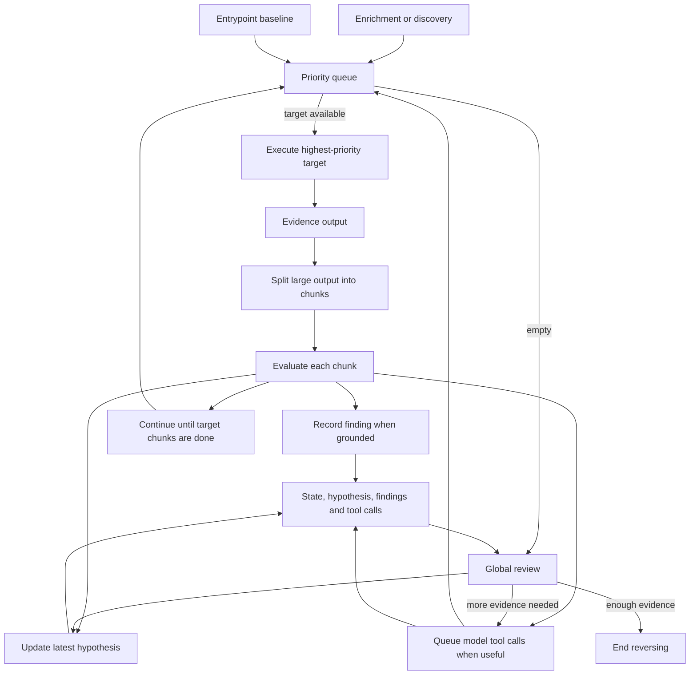

# Reverse Engineering

Reverse engineering has two modes:

- deterministic reverse engineering;
- agentic reverse engineering.

Deterministic reverse engineering gathers navigation and code evidence for the
sample. Agentic reverse engineering uses that evidence through a bounded
investigation loop.

## Agentic Reverse Engineering

The reversing agent starts from `enrichment.md` when that document exists and
contains useful content. The enrichment document guides the first targets that
the agent puts into its investigation queue.

Enrichment is used only during initial target selection. Later local analysis
does not receive enrichment context again.

If enrichment is unavailable or weak, the agent uses focused discovery tools
such as `list_imports`, `list_sections`, `list_entrypoints`, and
`list_functions` instead of guessing broad strings or addresses.

The initialization step records the model-selected initial `tool_calls`. AIM also
adds a small entrypoint baseline when a valid entrypoint can be resolved, so the
agent can still inspect code when the seed decision is weak.

When xrefs or discovery results identify an interesting code address, the agent
uses `disassembly` directly to retrieve the containing function body. Imports
are first explored with `import_xrefs`, so the agent follows callers in the
sample rather than disassembling API thunks.

When disassembly exposes an internal function target, the agent can inspect it
with `disassembly` or ask `callers` when the useful question is who else reaches
that function. Imported APIs and thunks are still handled through import xrefs.

The agent is queue-driven:


```mermaid
flowchart TD
    Seed[Enrichment or discovery] --> Queue[Priority queue]
    Entry[Entrypoint baseline] --> Queue
    Queue -->|target available| Target[Execute highest-priority target]
    Target --> Output[Evidence output]
    Output --> Chunks[Split large output into chunks]
    Chunks --> Evaluate[Evaluate each chunk]
    Evaluate --> Finding[Record finding when grounded]
    Evaluate --> Hypothesis[Update latest hypothesis]
    Evaluate --> ToolCalls[Queue model tool calls when useful]
    ToolCalls --> Queue
    ToolCalls --> Memory
    Evaluate --> Next[Continue until target chunks are done]
    Next --> Queue
    Finding --> Memory[State, hypothesis, findings and tool calls]
    Hypothesis --> Memory
    Queue -->|empty| Review[Global review]
    Memory --> Review
    Review -->|more evidence needed| ToolCalls
    Review --> Hypothesis
    Review -->|enough evidence| Done[End reversing]
```

For large assembly or xref outputs, AIM does not send everything in one prompt.
The evidence is recursively divided into bounded chunks. The agent evaluates all
chunks for the current target. If a chunk contains something useful, the agent
can enqueue investigation `tool_calls`, but the current target's chunks
continue until finished. After that, the exploration loop pops the next
highest-priority unvisited target from the queue.

Additional investigations are selected by the model as `tool_calls`. Xref
outputs, discovery results, and disassembly chunks are evidence for the model
to choose the next target; the runtime validates and deduplicates those targets
before queueing them. Step `tool_calls` show the model-selected calls before
queue validation; queue events record whether they were added, corrected, or
rejected.

Provider-native tool calls are accepted when the provider returns them. The
current reversing prompts also ask local models to emit a final `tool_calls:`
JSON line in message content because some local tool-calling models express the
intended calls more reliably in text. Both sources are normalized into the same
compact target format before validation.

The local `analyze_evidence()` prompt is intentionally narrow. It receives the
current target, a compact summary of the current tool output, and the current
bounded raw output chunk. It does not receive enrichment, global state, previous
hypotheses, or accumulated findings as local evidence. It may update the latest
hypothesis from the current output only; that hypothesis is tentative and is
revisited by global review.

When the queue becomes empty, AIM performs a separate global review model call.
That call receives factual state, recorded findings, and the current model
hypothesis. It decides whether more investigation is likely to materially
improve the result. If so, its `tool_calls` are validated, deduplicated, and
returned to the normal queue. If not, reversing ends.

The persisted runtime `state` includes queue size for the analyst-facing trace.
The compact state passed to global review includes only `steps`, `findings`,
`errors`, `discovery`, and `explored`; the queue is already empty at that point.

Local chunk analysis uses bounded model-decision retries inside the reversing
runtime. These retries repeat the same local evidence request; they do not
reintroduce enrichment, add a planner, or perform recovery-specific exploration.
Transport-level retries remain separate and only repeat equivalent HTTP/provider
requests.

Large disassembly output is split into instruction chunks. The agent still sees
the current function as one queued target, but each chunk becomes a separate
step in `reversing_agent.json`. For disassembly steps, the input records the
target address, chunk index, total chunks, and total instruction count.

Findings represent meaningful behavior. Prologue/epilogue code, generic
register or stack setup, arithmetic, generic control flow, and unresolved calls
are normally context, not findings. Findings generated from disassembly should
include direct code evidence, such as instruction addresses plus instruction
text. Static, dynamic, and enrichment context may support the interpretation,
but local findings must be grounded in the current tool output.

Detailed model reasoning from Ollama is stored as `decision.thinking`, split
into one list item per thinking line. `decision.summary` is the short readable
decision summary from model content. Machine-readable `finding:`,
`hypothesis:`, and `tool_calls:` lines are parsed out of the summary before the
trace is written.

`--max-targets` limits unique queued targets executed by the agent. It does not
count evidence chunks as separate targets.

Agent output is stored in:

```text
reversing_agent.json
```

The trace keeps `steps` as the primary analyst view:

```json
{
  "agent": "reversing_agent",
  "status": "completed",
  "hypothesis": {
    "malware": true,
    "type": "ransomware",
    "confidence": "medium"
  },
  "state": {
    "steps": 12,
    "findings": 3,
    "errors": 0,
    "discovery": {
      "entrypoints": true,
      "functions": false,
      "imports": true,
      "sections": true
    },
    "explored": {
      "functions": 2,
      "imports": 1,
      "sections": 1
    },
    "queue": {
      "pending": 0
    }
  },
  "steps": [],
  "findings": [],
  "queue": [],
  "errors": []
}
```

Each step keeps the executed tool in `input`, the model decision in `decision`,
and any model-selected investigations in `tool_calls`, even if validation later
rejects them:

```json
{
  "step": 4,
  "input": {
    "tool": "disassembly",
    "target": "entry0",
    "chunk": 1,
    "total_chunks": 2,
    "total_instructions": 71,
    "status": "ok"
  },
  "decision": {
    "thinking": [
      "The current chunk calls an unresolved internal helper.",
      "Understanding that helper would clarify this execution flow."
    ],
    "summary": "The chunk establishes API-resolution behavior and needs one helper inspected.",
    "confidence": "high"
  },
  "finding": {
    "type": "reverse_engineering",
    "category": "api_resolution",
    "confidence": "high",
    "summary": "The function resolves Windows APIs dynamically.",
    "function": "entry0",
    "address_range": "0x402068-0x4020d8",
    "evidence": [
      "0x402090: call KERNEL32.dll_GetProcAddress"
    ]
  },
  "tool_calls": [
    {
      "tool": "disassembly",
      "target": "fcn.004065e0",
      "priority": 75
    }
  ],
  "error": null
}
```

Initialization steps keep their initialization input and also record any queued
initial `tool_calls`:

```json
{
  "step": 1,
  "input": {
    "type": "initialization",
    "source": "enrichment"
  },
  "decision": {
    "thinking": [],
    "summary": "Initial targets selected from enrichment.",
    "confidence": "medium"
  },
  "finding": null,
  "tool_calls": [
    {
      "tool": "import_xrefs",
      "target": "KERNEL32.dll",
      "priority": 70
    }
  ],
  "error": null
}
```

Model-selected tool calls are compact targets:

```json
{
  "tool": "disassembly",
  "target": "0x4068d0",
  "priority": 75
}
```

## Related Tools

See [Reversing tools](../tools/reversing.md).
