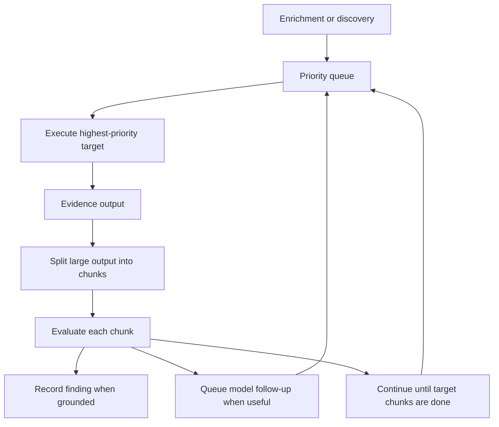

# Reverse Engineering

Reverse engineering has two modes:

- deterministic reverse engineering;
- agentic reverse engineering.

Deterministic reverse engineering gathers navigation and code evidence for the
sample. Agentic reverse engineering uses that evidence through a bounded
investigation loop.

## Agentic Reverse Engineering

The reversing agent starts from `enrichment.md` when that document exists and
contains useful content. The enrichment document guides the first targets that
the agent puts into its investigation queue.

If enrichment is unavailable or weak, the agent uses focused discovery tools
such as `list_imports`, `list_sections`, `list_entrypoints`, and
`list_functions` instead of guessing broad strings or addresses.

When xrefs or discovery results identify an interesting code address, the agent
uses `disassembly` directly to retrieve the containing function body. Imports
are first explored with `import_xrefs`, so the agent follows callers in the
sample rather than disassembling API thunks.

When disassembly exposes an internal function target, the agent can inspect it
with `disassembly` or ask `callers` when the useful question is who else reaches
that function. Imported APIs and thunks are still handled through import xrefs.

The agent is queue-driven:


```mermaid
flowchart TD
    Seed[Enrichment or discovery] --> Queue[Priority queue]
    Queue --> Target[Execute highest-priority target]
    Target --> Output[Evidence output]
    Output --> Chunks[Split large output into chunks]
    Chunks --> Evaluate[Evaluate each chunk]
    Evaluate --> Finding[Record finding when grounded]
    Evaluate --> FollowUp[Queue model follow-up when useful]
    FollowUp --> Queue
    Evaluate --> Next[Continue until target chunks are done]
    Next --> Queue
```

For large assembly or xref outputs, AIM does not send everything in one prompt.
The evidence is recursively divided into bounded chunks. The agent evaluates all
chunks for the current target. If a chunk contains something interesting, the
agent can enqueue a follow-up target, but the current target's chunks continue
until finished. After that, the exploration loop pops the next highest-priority
unvisited target from the queue.

Follow-ups are selected by the model through native tool calling. Xref outputs,
discovery results, and disassembly chunks are evidence for the model to choose
the next target; the runtime does not add automatic follow-ups by itself.

When the model selects a follow-up that the target validator rejects, AIM records
the rejected queue event and gives the model one recovery attempt with generic
context about the rejected tool, parameters, and validator message. The
validator still only performs deterministic corrections when the mapping is
unambiguous; it does not convert rejected actions into discovery tools by
itself. If the recovery action is rejected too, AIM records that rejection and
continues without looping.

Model decision retries are handled inside the reversing runtime. If a chunk
cannot be analyzed with `enrichment.md` included, AIM retries the same chunk
without enrichment context before recording a failed decision. Transport-level
retries remain separate and only repeat equivalent provider requests.

Large disassembly output is split into instruction chunks. The agent still sees
the current function as one queued target, but each chunk becomes a separate
step in `reversing_agent.json`. For disassembly steps, the input records the
target address, chunk index, total chunks, and total instruction count.

Findings generated from disassembly should include direct code evidence: at
least one instruction address plus the instruction text. Static, dynamic, and
enrichment context may support the interpretation, but it should not replace
direct code evidence.

Local models may occasionally write a finding object inside `decision.thought`
instead of emitting the native finding tool call. The reversing postprocessor
performs a narrow cleanup pass: if the text contains a parseable finding JSON
object, it moves that object into `finding` and replaces `thought` with a short
fallback note. It does not try to parse malformed pseudo tool-call syntax.

`--max-targets` limits unique queued targets executed by the agent. It does not
count evidence chunks as separate targets.

Agent output is stored in:

```text
reversing_agent.json
```

The trace keeps `steps` as the primary analyst view:

```json
{
  "agent": "reversing_agent",
  "status": "completed",
  "summary": {
    "steps": 0,
    "findings": 0,
    "queue_events": 0,
    "errors": 0
  },
  "steps": [],
  "findings": [],
  "queue": [],
  "errors": []
}
```

Each step separates the model decision from the executed action:

```json
{
  "step": 4,
  "input": {
    "type": "code",
    "target": "0x402068",
    "chunk": 1,
    "total_chunks": 2,
    "total_instructions": 71
  },
  "decision": {
    "thought": "The function contains API-resolution code worth recording.",
    "confidence": "high"
  },
  "action": {
    "tool": "disassembly",
    "target": "0x402068",
    "status": "ok"
  },
  "finding": {
    "type": "critical_code_region",
    "category": "api_resolution",
    "confidence": "high",
    "summary": "The function resolves Windows APIs dynamically.",
    "evidence": [
      "0x402090: call KERNEL32.dll_GetProcAddress"
    ]
  },
  "follow_ups": [],
  "error": null
}
```

`decision` contains only the model's analyst note and confidence. `action`
contains only the executed tool, its readable target, and execution status.
Follow-up targets and queue events are stored separately so tool execution,
model reasoning, and queue behavior are not duplicated.

Model-selected follow-ups are compact targets:

```json
{
  "tool": "disassembly",
  "target": "0x4068d0",
  "priority": 75
}
```

## Related Tools

See [Reversing tools](../tools/reversing.md).
